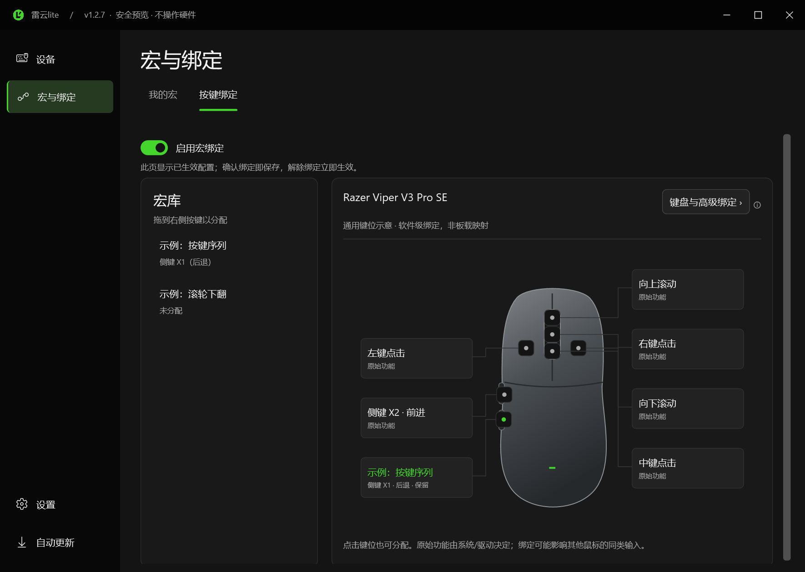
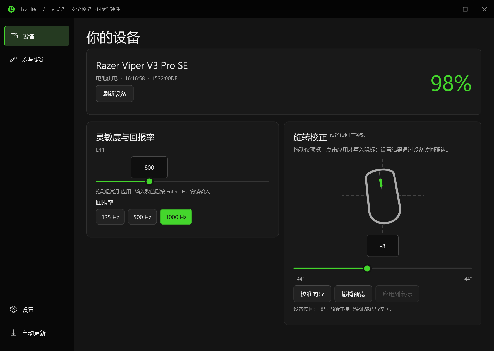
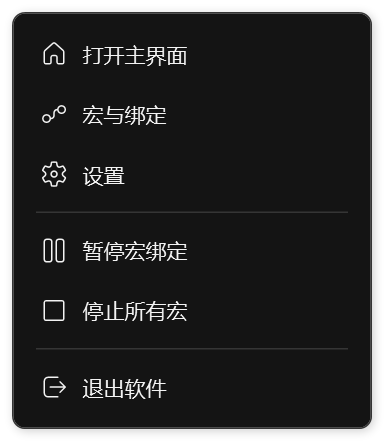
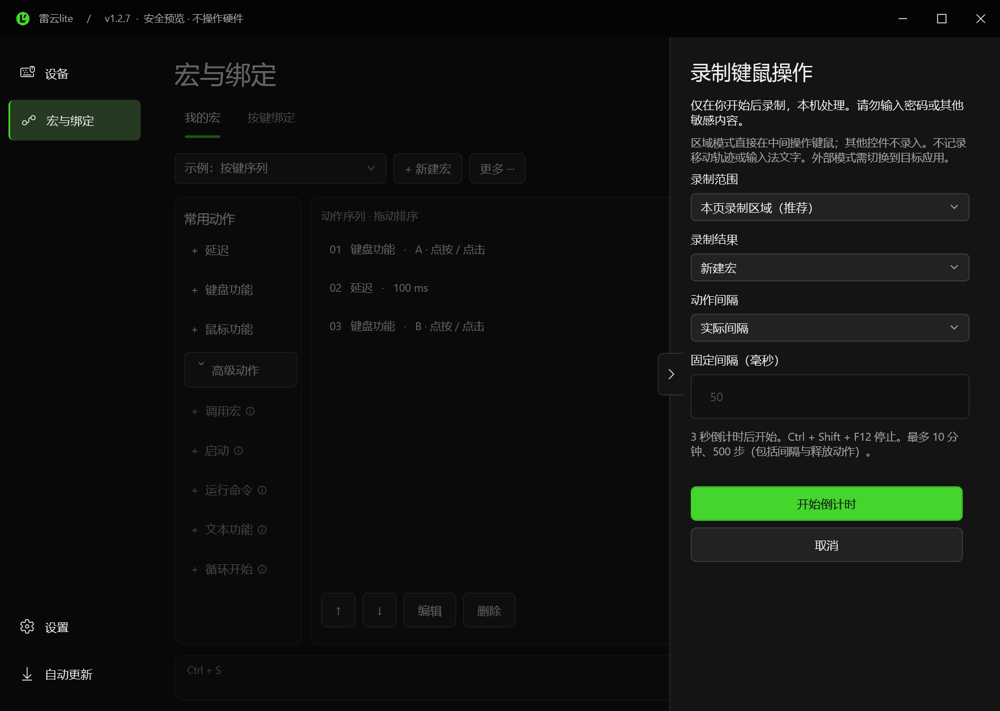
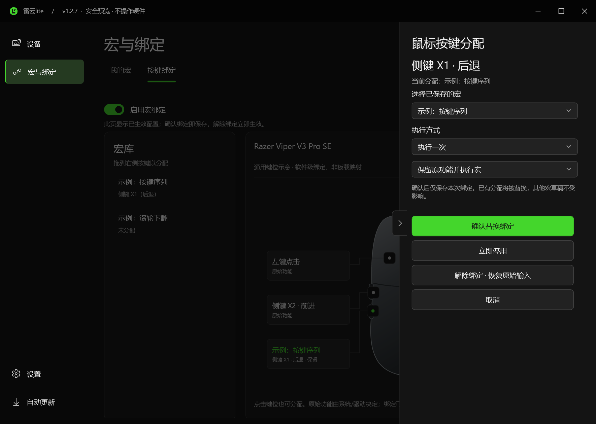
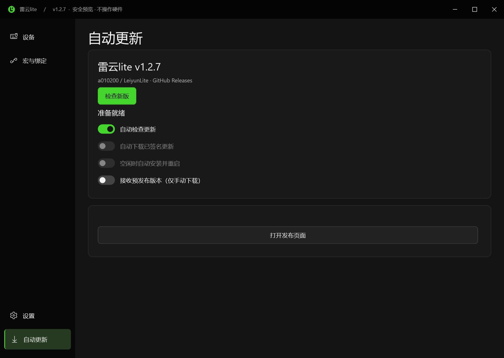

# 雷云lite · Leiyun Lite

面向部分雷蛇鼠标的 Windows 桌面工具：查看电量、调整 DPI 与回报率，编辑和录制本地宏，再把它们绑定到按键或滚轮。

**当前版本：v1.2.8** · Windows x64 · C# / WPF · .NET Framework 4.8 · [MIT License](LICENSE)

> [v1.2.8 发布说明](docs/RELEASE-v1.2.8.md) · [最新公开下载 v1.2.8](https://github.com/a010200/LeiyunLite/releases/tag/v1.2.8) · [安装与自动更新](docs/INSTALLING.md) · [更新记录](CHANGELOG.md) · [问题反馈](https://github.com/a010200/LeiyunLite/issues)

| 下载 | 适合谁 |
|---|---|
| [安装版 EXE](https://github.com/a010200/LeiyunLite/releases/download/v1.2.8/LeiyunLite-v1.2.8-Setup-x64.exe) | 希望有快捷方式、卸载入口和应用内安装更新 |
| [便携版 ZIP](https://github.com/a010200/LeiyunLite/releases/download/v1.2.8/LeiyunLite-v1.2.8-win-x64.zip) | 不安装，完整解压后直接运行；升级时手动替换程序 |
| [SHA256 校验文件](https://github.com/a010200/LeiyunLite/releases/download/v1.2.8/SHA256SUMS.txt) | 核对下载文件完整性 |

`update-x64.zip` 和 `update.json` 是供安装版自动更新使用的附件，不是便携包。GitHub 的 `Source code` 是源码，不是可以直接运行的软件。



*配图来自已发布 v1.2.7 的安全预览与实际 WPF 控件，使用演示数据；不代表真实设备读数或全型号验证。录制图仅展示设置面板，更新图未执行联网检查或安装。*

## 能做什么

| 功能 | 当前范围 |
|---|---|
| 设备状态 | 查看型号、电量、充电与连接状态；支持缓存读数、手动刷新、低电量提醒 |
| 旋转校正 | SE 已验证的随附接收器和有线控制接口可应用角度；真实读回，失败尝试恢复，其他接口只预览 |
| DPI 与回报率 | DPI 滑条和数值输入；按已识别设备的能力配置显示回报率，写入后读回核对 |
| 托盘 | 左键立即打开型号、电量、DPI 与回报率卡片；右键打开主界面、宏、设置，暂停绑定、停止宏或退出 |
| 宏编辑 | 延迟、键盘、鼠标按键/竖向滚轮、调用宏、启动程序/网址、运行命令、文本、有限次数循环 |
| 宏录制 | 显式开始/停止的本地键鼠录制；实际间隔、固定间隔或无间隔；录制后进入草稿 |
| 按键绑定 | 宏库拖拽/点击鼠标模型分配；确认即保存、解绑立即生效；高级入口保留键盘键/组合键；一次执行、按住重复或再次触发停止 |
| 安装与更新 | 当前用户安装；安装版验证项目签名后可一键升级重启，支持自愿开启空闲安装和失败回退；便携 ZIP 不自动执行 |
| 外观与设置 | 黑夜/白天主题、简体中文/英文、减少动画、刷新间隔、开机自启动、关闭到托盘 |

### 设备与性能

DPI 监测和主界面同步保留；当前界面不提供 DPI 浮窗或托盘图标样式选择。

滑条保持 **100～8000 DPI**、长度及样式不变，采用非线性映射放大低 DPI 区域，数值按 50 DPI 吸附。800 DPI 约在全长30%、1600约44%，方向键每次调50 DPI。输入框仍可输入设备能力范围内的数值；读到高于8000的已有设置时如实显示数值，滑块停在右端，不会自动改写鼠标设置。



### 轻量托盘

单击、双击或连续左键点击都只显示电量卡片，不会通过双击直接打开主窗口。打开窗口请点击卡片内的“打开主界面”，或使用右键菜单。



DPI 与回报率显示最近成功读取的缓存值，未知时显示“—”；打开卡片不会等待一次新的设备查询。读数不代表对实际 USB 报告频率进行测量。

## 开始使用

运行环境：**Windows 10/11 x64，.NET Framework 4.8**。本轮验证环境是 Windows 10 x64；Windows 11、多显示器和混合缩放仍需进一步实机验证。

1. 从上方选择安装版或便携版。若旧版仍在运行，先保存宏草稿、停止录制/播放，再从托盘菜单选择“退出”。
2. **安装版**：运行 `LeiyunLite-v1.2.8-Setup-x64.exe`，之后使用安装生成的快捷方式。**便携版**：完整解压 `LeiyunLite-v1.2.8-win-x64.zip` 到新目录，再运行 `LeiyunLite.Desktop.exe`。两种版本不要同时运行。安装目录的 `LeiyunLite.exe` 是新的固定启动入口，不是上游旧软件。
3. 在“设备”页查看状态。型号未明确识别时，不会开放未经确认的 DPI/回报率写入。
4. v1.1.0 及更早便携版不会自动变成安装版，需要手动运行一次安装程序；个人宏和设置沿用原位置。便携版更换路径后，如需自启动，请在设置中重新启用“开机自启动”。

程序尚未进行代码签名。请从本仓库获取软件或源码，并按 Release 中的 `SHA256SUMS.txt` 核对下载文件；不要为运行它关闭系统安全防护。官方雷云等其他设备工具同时运行时，可能出现设备通信争用。

### 不连接鼠标，先看界面

在 EXE 所在目录执行：

```powershell
.\LeiyunLite.Desktop.exe --demo
```

安全预览使用模拟设备，不读写鼠标、不监听键鼠录制、不执行宏输入或命令、不保存设置。**它只能看界面，不能用于测试真实录制或硬件控制。**

### v1.2.8

- 优化按钮、开关、下拉面板和侧边页面的弹性交互，让界面操作更自然顺滑。
- 改善右侧面板与录制体验，修复弹层交互问题并加入录制前 3→2→1 倒计时提示。
- 完善 Viper V3 Pro SE 有线旋转校正，修复有线或充电连接下重启后角度显示为 0°、无法应用的问题。

详见[版本说明](docs/RELEASE-v1.2.8.md)和[更新记录](CHANGELOG.md)。Motion 专项的剩余对照与手感验收保留到 v1.2.9，不阻塞本次发布。
普通启动不显示输入诊断；需要协助排查宏时，正常退出已有实例后使用`LeiyunLite.Desktop.exe --diagnostics`启动。`--demo --diagnostics`仅查看诊断界面，不监听输入。

## 录制一个宏，再绑定到按键

1. 打开“宏与绑定 → 我的宏”，新建宏，或点击“录制”。
2. 选择“本页录制区域”、新建/追加以及动作间隔。3 秒倒计时后，在中央绿色边框区域实际按键、点击鼠标或滚动滚轮，动作实时显示；失焦暂停，点击区域恢复。若要切换到其他软件录制，请显式选择“外部应用”。
3. 完成操作后点击“停止”，或按 **Ctrl + Shift + F12**。
4. 录制结果进入未保存草稿。检查动作、延迟和循环，删除不需要的步骤。
5. 在“我的宏”先点击“保存并应用”。切到“按键绑定”，把左侧已保存的宏拖到右侧鼠标键位（也可直接点击键位），选择执行方式和是否保留原始输入，点击“确认绑定”即保存。键盘/组合键使用“键盘与高级绑定”。
6. 切换到目标程序再触发绑定。雷云lite 自己的窗口获得焦点时不会触发普通绑定。





**Ctrl + Shift + F12 是紧急停止快捷键**，托盘也提供“停止所有宏”。请先用无风险的动作测试绑定，再考虑拦截鼠标原始按键。

点击“解除绑定”会立即撤销并保存，无需再点击全局保存。停用单个绑定、关闭绑定总开关、删除已保存的宏也会停止当前宏播放；为安全起见，此时会停止所有正在播放的宏。保存宏草稿不会恢复已解除的绑定。若磁盘保存失败，当前会话仍保持停用，但界面会提示“重启可能恢复旧配置”，请重试保存，不能把错误提示当作保存成功。

鼠标模型是通用键位示意，并非特定型号的硬件图。未绑定时标注常见原始功能；侧键实际行为由系统/其他驱动决定。左键替换必须额外确认风险，默认保留原始点击。

录制与回放的边界：

- 只在明确开始录制后采集；结果在本机处理，不自动上传。请勿录制密码或其他敏感信息，软件不能可靠识别所有应用的密码框。
- 不记录鼠标移动或坐标。回放点击作用于当时指针所在位置；记录的是按键，不是输入法最终文字。
- 单次录制最多 10 分钟、每宏最多 500 步（包含延迟和预留松开动作）；不会自动推断循环或命令。
- 宏是软件级功能，退出程序后不再生效，不写入鼠标板载内存；绑定不能限定到某一台物理键盘或鼠标。
- 滚轮不支持“按住重复”。一次只执行一个宏，执行期间的新触发不排队。
- 管理员窗口、系统安全桌面、游戏原始输入与反作弊环境不保证兼容，不提供绕过机制。
- 宏可包含启动程序、网址或运行命令的动作。使用他人提供的宏前，先检查其内容。

当前版本的变化与边界见[v1.2.8 说明](docs/RELEASE-v1.2.8.md)。[v1.1.0 使用与升级说明](docs/RELEASE-v1.1.0.md)及 R3/R4/R5 文档保留为历史记录。

### 旋转校正

旋转校正最初在 v1.2.1 验证 SE 随附接收器；v1.2.8 新增同一设备的已验证有线控制接口：**Viper V3 Pro SE（1532:00DE / 00DF，HID 设备版本字段 0100，91 字节控制接口，正确接口用途）**。有线与双连接的普通启动、重启和真实读回已验收。0100 是设备描述符版本，不是独立读取的固件版本。其他 PID、设备版本、接口用途或报告长度保持禁用。

滑块只改变预览，点击“应用到鼠标”后才写入。输入框可直接键入 −44°～44° 的整数；设备当前角度独立显示。设置会绑定当前设备实例，执行“读原值 → 写目标 → 读回”，失败时尝试恢复原值并确认；无法确认恢复时明确提示。“撤销预览”只撤销未应用的编辑，不改设备。校准向导仍使用系统指针轨迹，只提供建议。

在官方雷云主程序退出后，0°、+10°、−10° 各三次手动直线试验的 Raw Input 平均方向分别为 8.99°、20.75°、0.58°，正负组差 20.17°；九次设置读回与原值恢复均确认。用户确认效果后批准发布。测试机仍有官方后台服务和驱动，**不宣称完全脱离厂商驱动**。此段为 v1.2.1 历史试验；休眠、游戏、其他型号及边界角度仍未完整验收。详见 [历史旋转记录](docs/ROTATION-VALIDATION.md)及 [v1.2.8 说明](docs/RELEASE-v1.2.8.md)。

## 安装与更新

安装版提供固定启动入口、卸载项和可选快捷方式。自动检查默认开启，自动下载/空闲安装默认关闭；便携版只提供手动 ZIP 下载。安装前需保存草稿、停止录制/执行，并处理解绑保存失败，不能通过强制退出跳过这些保护。

自动安装仅在用户主动开启且至少2分钟无键鼠操作时进行。更新来自本仓库 GitHub Releases，稳定更新包必须通过项目 RSA-SHA256 签名、哈希、大小、文件名单与路径校验；新版健康握手后切换，失败保留旧版和配置备份。不会重启电脑，不会自动升级配置格式。

更新检查在 GitHub 匿名 API 限流时按服务端恢复时间退避，避免反复请求。



项目更新签名不等于 Windows 代码签名，仍可能遇到系统提示。完整方法、构建命令和边界见 [安装与更新](docs/INSTALLING.md)。

## 设备兼容性与尚未完成的功能

身份目录包含固定版本 OpenRazer 的113条鼠标相关 PID，另补 SE 两项、Dock 和一项键盘排除。**识别型号不等于支持控制，也不承诺全系列全部设备可用**。新增型号仅显示身份；通用接收器不推断其配对鼠标。HID 属性、接口用途与报文校验共同决定是否可读，缓存按实例隔离；失败时显示未知而非虚构50%/800/1000。

下表是**保留的实验性兼容控制范围**，不是已全面实测的设备清单；最高回报率还取决于鼠标、接收器和连接方式。

| 设备 / 连接 | PID | 当前配置的回报率 |
|---|---|---|
| Viper V3 Pro SE：有线 / 随附接收器 | `00DE` / `00DF` | 125、500、1000 Hz |
| Viper V3 Pro：有线 | `00C0` | 125、500、1000 Hz |
| Viper V3 Pro：专用接收器 | `00C1` | 125、500、1000、2000、4000、8000 Hz |

以上配置的 DPI 范围为 100–35000。已记录 SE 随附接收器的 500 Hz 实机读取；不能据此宣称所有型号、所有档位的写入都已验收。其他设备即使可以显示信息，也不代表支持性能参数写入。能力配置见 [DeviceCapabilities.cs](Desktop/DeviceCapabilities.cs)。

目前不提供：

- 未验收设备/连接的旋转写入；已支持范围不代表全系列兼容。
- Windows 可信发布者代码签名、自动升级启动器协议或不兼容配置格式；这些不能由普通更新包绕过。
- 灯光管理、固件升级、完整板载配置或专有多侧键支持。
- 全型号兼容保证、游戏/反作弊兼容保证。

## 从源码构建

在当前源码根目录打开 PowerShell；当前标签为 [v1.2.8](https://github.com/a010200/LeiyunLite/tree/v1.2.8)。项目入口为 `LeiyunLite.Desktop.csproj`；解决方案保留兼容文件名 `LeiyunLite.R3.sln`，但构建的是当前目录源码，并非固定 R3。

### 方式一：使用现有 .NET Framework 编译器

```powershell
powershell.exe -NoProfile -ExecutionPolicy Bypass -File .\build-desktop.ps1
```

脚本使用 Windows 上已有的64位 .NET Framework 编译器和 WPF 程序集，并从 `Tools/LiteIconBuilder.cs` 生成图标，不需要下载第三方 NuGet 包。要求相应编译器和程序集实际存在；运行环境仍需 .NET Framework 4.8。

产物：`bin\Desktop1.2.8\LeiyunLite.Desktop.exe`。

### 方式二：MSBuild / VS Code 开发构建

安装 Visual Studio 2022 Build Tools 的 .NET 桌面构建工具及 .NET Framework 4.8 Developer Pack。所需图标资源已包含在源码中，可直接运行：

```powershell
powershell.exe -NoProfile -ExecutionPolicy Bypass -File .\Tools\Build-VSCode.ps1
```

产物：`bin\VSCode1.2.8\LeiyunLite.Desktop.exe`。在 VS Code 打开仓库内的 **`LeiyunLite.code-workspace`**，可按 **Ctrl + Shift + B** 执行 `v1.2.8: Build`。

> 公开工作区不含维护者的本机路径或编辑器缓存。编辑器代码分析与编译是两回事；环境设置及常见问题见 [构建与开发](docs/BUILDING.md)。F5 断点调试尚未配置。

### 测试

```powershell
powershell.exe -NoProfile -ExecutionPolicy Bypass -File .\build-desktop.ps1 -Test -Regression -OutputDirectory bin\Verification
```

测试会显示独立窗口；部分回归测试向自己的测试文本框发送输入并使用临时注册表键，运行时请避免抢焦点。不加 `-Hardware` 不进行实机读取；硬件测试为可选只读检查，不代表实机写入已通过验证。

当前版本的修复与验证边界见[v1.2.8 说明](docs/RELEASE-v1.2.8.md)；各版本记录见[更新记录](CHANGELOG.md)。测试结果不代表所有设备、游戏或输入环境均已通过实机验收。

## 源码结构

版本规则：每完成一轮软件修复，第三位版本号加1，无论是否发布；仅上传已有版本不额外加号。每次发布提供同版本安装 EXE、便携 ZIP 及签名更新附件。详见 [版本与发布规则](docs/VERSIONING.md)。

```text
Desktop/       WPF 主窗口、宏页、托盘、更新会话、主题和动画
Updates/       签名验证、部署、版本状态、健康握手、回退与数据保护
Installer/     Inno Setup 当前用户安装脚本
Devices/       HID 传输、设备查询与协议
Macros/        宏模型、录制、播放、按键路由、本地存储和共享 MacroLabels
Models/        通用数据模型
Services/      设置、自启动、设备缓存和 DPI 监测
Tests/         桌面、宏与底层回归测试
Tools/         图标生成及开发构建工具
docs/          各阶段使用说明与验证记录
screenshots/   界面配图
```

历史说明只代表对应版本；当前源码状态以本页和 `CHANGELOG.md` 为准，v1.2.8 状态见 `docs/RELEASE-v1.2.8.md`，公开 v1.2.7 记录保持不变。旧 WinForms UI 与旧构建入口已移除；当前软件仅构建 `LeiyunLite.Desktop.csproj`，使用 `Desktop/` 中的 WPF 界面。

这个独立仓库从 **v1.2.1 的代码快照**开始记录，不导入旧仓库的提交历史。此前版本已另行留档，迁移不改变当时的程序包、更新地址或设备支持范围。前期界面评审保留在 [UI-REDESIGN-FINAL.md](UI-REDESIGN-FINAL.md)和[UI-VISUAL-RECALL-REVIEW.md](UI-VISUAL-RECALL-REVIEW.md)，历史配图来源见 [screenshots/README.md](screenshots/README.md)。

## 配置文件与反馈

- 宏与绑定：`%LOCALAPPDATA%\LeiyunLite\macros.xml`。
- 新界面偏好：`%LOCALAPPDATA%\LeiyunLite\desktop.xml`。
- 保存替换已有 XML 时保留 `.bak`；设备相关设置和缓存沿用 `HKCU\Software\RazerBatteryTray`。
- 配置不随 EXE 自动搬迁。分享源码、日志或截图前，请检查并移除个人信息和宏中的敏感内容。

请通过 [GitHub Issues](https://github.com/a010200/LeiyunLite/issues) 反馈问题，提供版本、Windows版本、鼠标/接收器型号、连接方式、PID（能看到时）、复现步骤及错误信息。不要上传密码、访问令牌或含敏感输入的宏文件。

## 致谢与许可

本项目在 [Ferris-echo/RazerBatteryTray](https://github.com/Ferris-echo/RazerBatteryTray) 基础上进行模块化重构和界面、宏功能扩展。保留原项目 [MIT许可证及版权声明](LICENSE)，原许可证署名为 **Zhaopf**。

Razer、雷蛇及相关产品名称归各自权利人所有，此处仅用于说明设备兼容性。当前应用图标由项目中的 `Tools/LiteIconBuilder.cs` 绘制，不使用官方雷蛇或雷云徽标。
